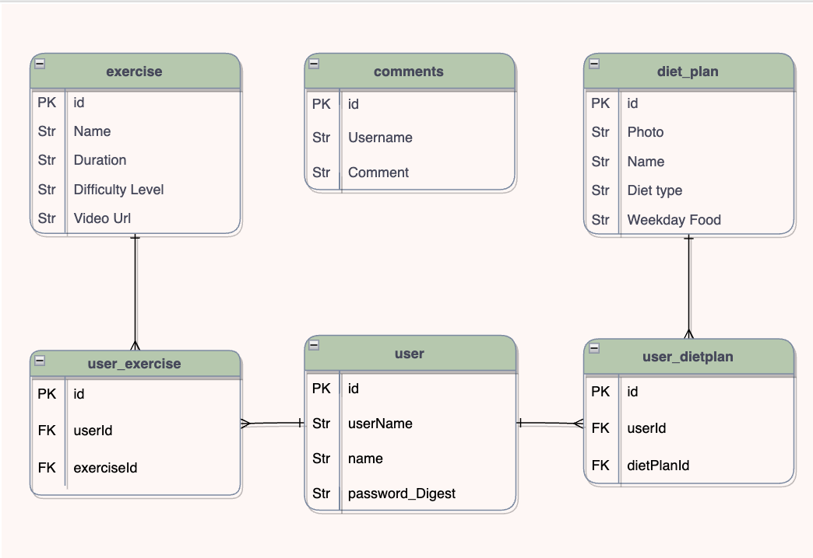

# FitNow-BackEnd

### [Aekangi Patel LinkedIn](https://www.linkedin.com/in/aekangipatel/)

### [FitNow-FrontEnd](https://github.com/Aekangi/FitNow-FrontEnd)

## [FitNow App]()

## Description

FitNow is designed for those individuals that would like to get fit through exercises and diet plans. There comes a point where you would like to go on a diet but you get confused on what to eat. Worry no more! This app has well designed diet plans for each day of the week to take that confusion away.

## Getting Started

### Technologies Used

### 

### Future Updates

#### Work Progress

[Trello Board](https://trello.com/b/A2NWRgj5/fitnow)

#### Credits
